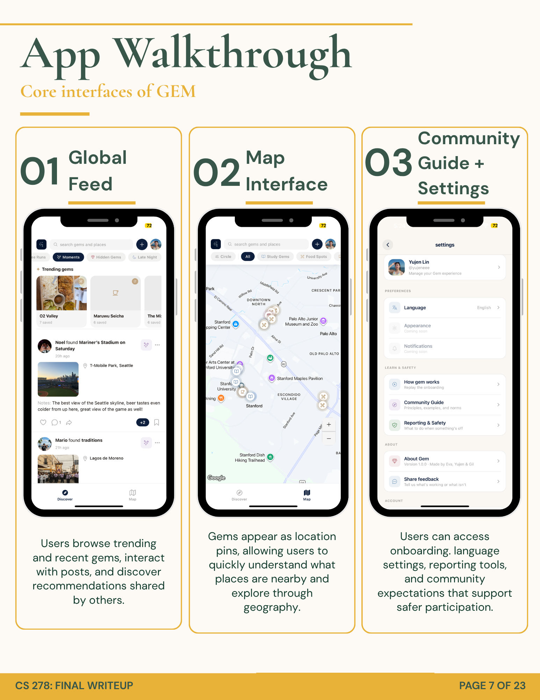
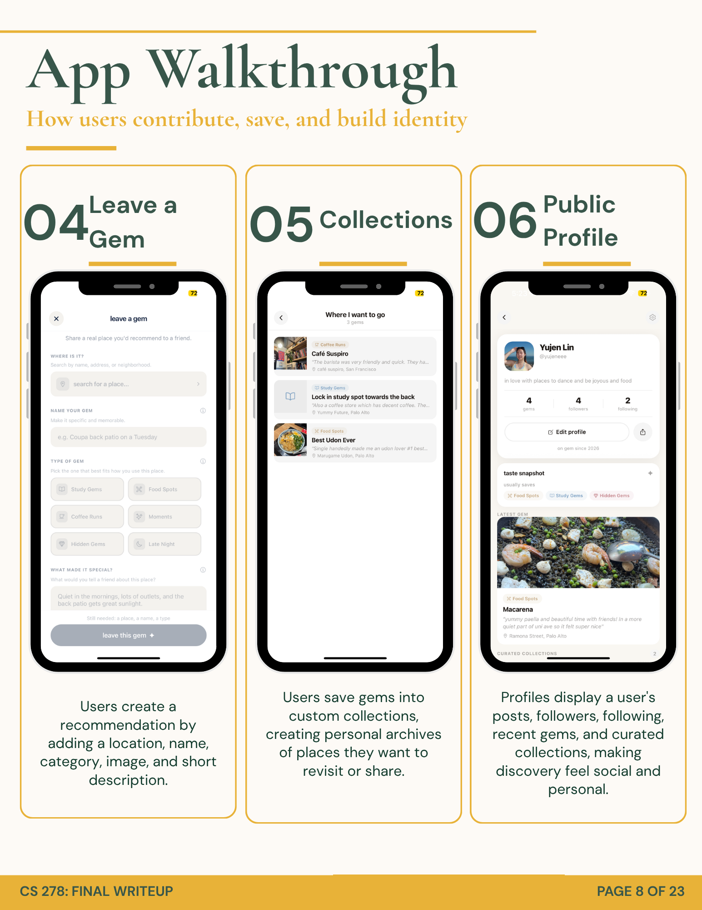
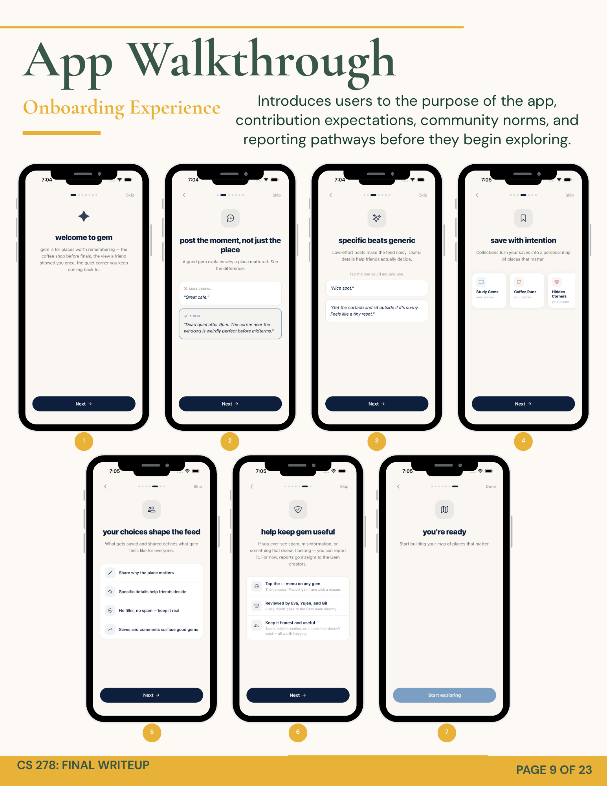
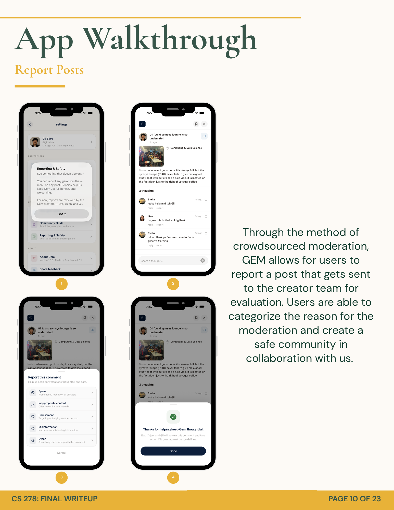

# Gem

**Places worth remembering.**

Gem is a social mobile application for discovering and sharing meaningful places through people you trust. Rather than surfacing recommendations from anonymous reviewers or engagement-optimized algorithms, Gem builds a personal map from the opinions of friends, classmates, and others whose taste you have chosen to follow.

Built for CS278: Social Computing, Stanford University, Spring 2026.

---

## Quick Start

**Requirements:** Node.js 20+, the [Expo Go](https://expo.dev/go) app on your iOS or Android device.

```bash
git clone <repo-url>
cd gem
npm install
npx expo start
```

Scan the QR code with Expo Go. The app connects to the live Supabase project by default and requires no additional configuration.

**Environment variables:** Supabase credentials are stored in `gem/.env`. Copy `gem/.env.example` and fill in your own values if you want to point the app at a different Supabase project.

**Distributing a build via EAS:**

```bash
npm install -g eas-cli
eas login
eas update --auto
```

Share the resulting EAS update URL. Testers open it directly in Expo Go.

---

## Motivation

Mainstream place-discovery platforms optimize for volume and engagement. The result is thousands of anonymous reviews that are difficult to contextualize and easy to game. In practice, people rely on a much smaller and more trusted signal: a recommendation from a friend, a roommate, a professor, or someone whose judgment they have tested over time.

Gem is built around that observation. Every pin in Gem is a personal recommendation attached to a real person whose profile, taste tags, and history are visible. The social graph is not decorative. It determines what appears in your feed and shapes every discovery experience in the app.

---

## Features

### Feed and Discovery

The Discover feed surfaces public gems from across the network, with a horizontally scrollable trending section at the top showing the most-saved places. Posts from accounts you follow display a "circle" badge, giving social context even in the global feed.

Circle mode collapses the feed to gems authored exclusively by accounts you follow, reducing noise and foregrounding trusted recommendations. Both modes support category filters: Study Gems, Food Spots, Coffee Runs, Moments, Hidden Gems, and Late Night.

### Map View

An interactive Google Maps view renders every gem as a color-coded, icon-labeled pin organized by category. Tapping a pin surfaces a slide-up preview sheet; a second tap navigates to the full gem detail. The map supports the same Circle mode filter as the feed and defaults to Stanford's campus. Custom map styles are applied for both light and dark themes.

### Creating a Gem

The compose screen prompts for a place name, category, optional photo, and a personal note. The location picker queries the app's Supabase database first, then falls back to the OpenStreetMap Nominatim API for unrecognized locations, with a manual entry option as a final fallback. The onboarding flow explicitly models what a high-quality, specific gem looks like before a user posts for the first time.

### Collections

Users can organize saved gems into named collections such as "Study Spots" or "Late Night Eats." Each collection can be set to public, making it visible on the user's profile, or private. Collections are browsable in full through a dedicated detail screen and display live item counts.

### Profiles

Each profile includes a display name, a unique @handle, a bio, a taste tagline (a single sentence describing what the user values in a place), and up to eight free-form taste tags. These fields are designed to help other users evaluate whether a profile is worth following before committing to a follow relationship. Profiles also display follower and following counts, the user's gem count, public collections, and a preview of the user's latest gem.

### Social Graph

Following another user is a deliberate, consequential action. The set of accounts you follow directly controls what appears in Circle mode. The follow decision is supported by taste tags and taglines, which provide enough signal to assess taste alignment before following.

### Saving and Bookmarking

Any gem can be saved with a single tap. The save count on each gem is visible to all users, functioning as lightweight social proof. Gems can also be bookmarked into specific collections for later reference.

### Comments and Replies

Users can leave comments on any gem. Comments support one level of threaded replies. Comment likes are persisted to the database and displayed as counts. Users can delete their own comments and report others' comments through a structured report flow.

### Reporting and Moderation

Both gems and comments can be reported through a categorized report sheet (Spam, Inappropriate Content, Harassment, Misinformation, or Other). Reports are submitted to the Supabase database for team review. The reporting flow is introduced during onboarding, framing community moderation as a shared responsibility rather than a hidden safety valve.

### Onboarding

First-time users complete a seven-step interactive onboarding flow before reaching the app. The flow includes an interactive choice game that asks users to select which of two example gems is more useful, explicitly establishing quality norms before a user posts. Each user's onboarding completion is tracked per-account in AsyncStorage.

### Language and Theme Support

The app supports English and Spanish, switchable from Settings, with language preference persisted across sessions via AsyncStorage. Full light and dark theme support is implemented throughout, with custom map styles for each theme.

---

## Screenshots

**Feed, Map, and Settings**



**Compose, Collections, and Profile**



**Onboarding Experience**



**Reporting and Moderation**



---

## Technical Architecture

### Frontend

The client is a React Native application packaged with Expo SDK 54, targeting iOS and Android. Navigation is implemented with React Navigation using a bottom tab navigator for the two primary views (Discover and Map) nested inside a native stack for all modal-style screens. Theme state and the authenticated user object are managed at the root level in `App.js` and passed as props throughout the tree.

The feed is rendered with a virtualized `FlatList`. Map markers use `React.memo` and carefully manage `tracksViewChanges` to avoid the rendering performance pitfall common in `react-native-maps` when custom marker content changes. Localization uses `i18next` and `react-i18next` with a custom AsyncStorage detector that persists the user's language choice across sessions.

### Backend

The backend is a Supabase project providing PostgreSQL, authentication, file storage, and a REST API. There is no intermediate server layer. The client communicates directly with Supabase through its JavaScript SDK.

### Database

The core schema includes the following tables:

| Table | Purpose |
|---|---|
| `profiles` | Extended user data: handle, bio, taste tagline, taste tags, avatar |
| `gems` | User-created place recommendations |
| `places` | Geocoded location data (name, city, latitude, longitude) |
| `gem_images` | Ordered photo attachments stored in Supabase Storage |
| `comments` | Comments with optional `parent_comment_id` for one-level threading |
| `comment_likes` | Per-user comment likes with composite primary key |
| `saves` | Many-to-many relationship between users and gems |
| `collections` | Named, visibility-controlled sets of saved gems |
| `collection_gems` | Junction table linking collections to gems |
| `follows` | Directed follow graph between users |
| `reports` | Structured reports on gems and comments |

Row Level Security is enabled on all tables. Policies enforce ownership on all write operations: for example, gems can only be deleted where `auth.uid() = author_id`, and follows can only be created or deleted where `auth.uid() = follower_id`.

The feed is generated by a PostgreSQL stored procedure, `get_feed(p_limit, p_offset)`, called via Supabase RPC. The function joins `gems`, `places`, `gem_images`, `profiles`, and `saves` in a single query and injects `is_saved` and `save_count` fields computed from the calling user's identity via `auth.uid()`. This avoids multiple round-trip queries from the client to assemble the feed.

### Authentication

Authentication uses Supabase's Google OAuth implicit flow, opened in an in-app browser via `expo-web-browser`. A deep-link handler in `App.js` parses the token hash fragment returned to the custom URI scheme on Android, where Chrome Custom Tabs cannot reliably detect scheme redirects. Sessions are persisted to AsyncStorage and automatically refreshed by the Supabase client.

### Storage

User-uploaded gem photos are stored in a Supabase Storage bucket (`gem-images`). The client uploads images using `expo-image-picker` and stores the resulting storage path in the `gem_images` table. Public URLs are resolved on the client at render time.

### Maps and Place Search

Map rendering uses `react-native-maps` with the Google Maps provider and custom-styled tile configurations for light and dark modes. Place search during gem creation queries the Supabase database first for previously entered locations, then falls back to the OpenStreetMap Nominatim API, which requires no paid API key.

### Collections and Feed Architecture

Collection item counts are maintained as a denormalized `item_count` column on the `collections` table, recalculated from the true `collection_gems` row count after each save or remove operation to prevent drift. The social feed is filtered client-side between Discover and Circle modes using a `Set` of following IDs fetched alongside the feed data, avoiding an additional query on mode switch.

---

## Social Computing Concepts

Gem draws on three core theories from CS278: Social Computing. These concepts shaped both how the system was designed and what behaviors we expected to see.

### Social Proof and the Cold Start Problem

One of the central challenges for any new social platform is establishing a sense of activity before a large user base exists. Drawing on social proof theory, we recognized that users are significantly more likely to participate when they perceive an existing, active community. An empty feed provides no signal that the platform is worth engaging with.

To address this, we prepopulated the platform with posts from the development team before opening it to participants. Our hypothesis was that users would be more willing to contribute and return if they could see that others had already done so, particularly people within their network. The global feed was designed for this early stage specifically: rather than showing only posts from followed accounts, it surfaces all public gems, making the platform feel active even with a small user base. A circle-based feed, while preferable at scale, would have appeared empty to new users and discouraged initial engagement.

### Weak Ties and Strong Ties

Gem is designed to operate at the boundary between weak and strong ties. The platform surfaces recommendations from a broad social network rather than requiring close friendships as a prerequisite for meaningful discovery. A user does not need a deeply formed relationship with someone to benefit from their gem posts.

The intended use pattern is to leverage weak ties for place discovery and use that discovery as a bridge toward stronger social interaction. Finding a place through a loose connection can prompt a conversation, lead to making plans with a closer friend, or open a new interaction with the person who posted. Gem does not aim to replace strong-tie relationships but to use the wider network as a source of inspiration that flows into those closer connections. The follow graph and taste tags support this by giving users enough signal to determine whether a connection is worth engaging with, even without a prior relationship.

### Injunctive Norms and User-Based Moderation

To maintain a useful and respectful community, Gem introduces norms early and makes them persistent. Rather than relying on descriptive norms (what most people do) alone, we focused on injunctive norms (what the community considers appropriate behavior) established at the point of first use.

The seven-step onboarding flow explicitly models what a good gem looks like. It includes examples of low-quality posts alongside higher-quality ones and uses an interactive choice exercise to make the distinction concrete before a user posts for the first time. The community guidelines remain accessible from the Settings screen, so the reference point is never buried. For enforcement, the platform uses user-based moderation: any gem or comment can be reported through a structured flow with five categories. Reports are reviewed directly by the development team. This combination of early norm-setting, accessible guidelines, and crowdsourced reporting was our approach to building a culture of contribution quality without requiring automated moderation infrastructure.

---

## Project Structure

```
gem/
├── App.js                       # Auth listener, onboarding gate, navigation root
├── supabase.js                  # Supabase client configuration
├── constants.js                 # Categories, theme tokens, map styles
│
├── screens/
│   ├── Login.js                 # Google sign-in and guest demo mode
│   ├── OnboardingScreen.js      # Seven-step interactive onboarding
│   ├── FeedView.js              # Discover and Circle feed with trending strip
│   ├── MapView.js               # Interactive map with category pins
│   ├── AddPin.js                # Gem compose screen
│   ├── PinDetail.js             # Full gem detail view
│   ├── PostComments.js          # Threaded comment screen
│   ├── Profile.js               # User profile, collections, follow graph
│   ├── Search.js                # Search across gems and users
│   ├── CollectionDetail.js      # Collection contents view
│   ├── Settings.js              # Language, theme, and account settings
│   └── CommunityGuide.js        # Community guidelines
│
├── components/
│   ├── SaveToCollectionModal.js  # Collection save bottom sheet
│   └── ReportModal.js            # Report bottom sheet for gems and comments
│
├── services/
│   ├── places.js                # Nominatim and Supabase place search
│   └── share.js                 # Native share sheet integration
│
├── localization/
│   ├── i18n.js                  # i18next initialization
│   └── translations/
│       ├── en.json
│       └── es.json
│
└── assets/
    ├── logo.png
    ├── icon.png
    ├── adaptive-icon.png
    └── splash-icon.png
```

---

## Meet the Team

### Eva Wanek

Electrical Engineering / Computer Science, Class of 2027, Stanford University

[evawanek@stanford.edu](mailto:evawanek@stanford.edu) · [LinkedIn](https://www.linkedin.com/in/evawanek/) · [GitHub](https://github.com/Evamwanek)

---

### Gil Silva

Symbolic Systems (HCI), Class of 2027, Stanford University

[gilsilva@stanford.edu](mailto:gilsilva@stanford.edu) · [LinkedIn](https://www.linkedin.com/in/gilxsilva/) · [GitHub](https://github.com/gilxsilva)

---

### Yujen Lin

Symbolic Systems, Class of 2027, Stanford University

[ylin13@stanford.edu](mailto:ylin13@stanford.edu) · [LinkedIn](https://www.linkedin.com/in/yujen-lin-766853292/) · [GitHub](https://github.com/yujeneee)

---

## Future Work

Several directions emerged during the project that were not implemented within the course timeline.

**Second-degree recommendations.** When a user you follow saves a gem, that action could surface the gem to their followers as a soft signal. This would extend trust propagation one step beyond the direct follow relationship.

**Collaborative collections.** Collections could be opened to multiple contributors, enabling shared curation for trips, neighborhoods, or recurring group contexts such as weekly study sessions.

**Place memories.** After visiting a gem, a user could attach a follow-up note recording whether the experience matched the recommendation. This would transform Gem from a recommendation layer into a personal place journal.

**Travel mode.** A temporary radius expansion when a user is in an unfamiliar location would surface gems from their network in that area, extending the trust graph to places they do not frequently visit.

**Taste-based discovery.** Overlapping taste tags between profiles could power a recommendation system that suggests accounts to follow, connecting the interest graph to the place graph.

---

## Tech Stack

| Layer | Technology |
|---|---|
| Framework | React Native, Expo SDK 54 |
| Navigation | React Navigation (Native Stack, Bottom Tabs) |
| Backend | Supabase (PostgreSQL, Row-Level Security) |
| Authentication | Supabase Auth, Google OAuth (implicit flow) |
| Database queries | Supabase JS client, custom `get_feed` RPC |
| Storage | Supabase Storage |
| Maps | Google Maps via `react-native-maps` |
| Place search | OpenStreetMap / Nominatim |
| Icons | Ionicons via `@expo/vector-icons` |
| Localization | i18next, react-i18next |
| Session persistence | AsyncStorage |
| Image selection | expo-image-picker |
| OAuth browser | expo-web-browser, expo-linking |
| Build and distribution | EAS (Expo Application Services) |

---

## Acknowledgements

This project was developed for CS278: Social Computing at Stanford University. We are grateful to the CS278 course staff for their guidance throughout the quarter.

The following open-source projects and platforms made Gem possible:

- [Supabase](https://supabase.com) for the backend infrastructure
- [Expo](https://expo.dev) for the mobile development framework and distribution tooling
- [OpenStreetMap](https://www.openstreetmap.org) and the Nominatim geocoding service for location search

---

*CS278: Social Computing, Stanford University, Spring 2026 — [cs278.stanford.edu](https://cs278.stanford.edu)*
